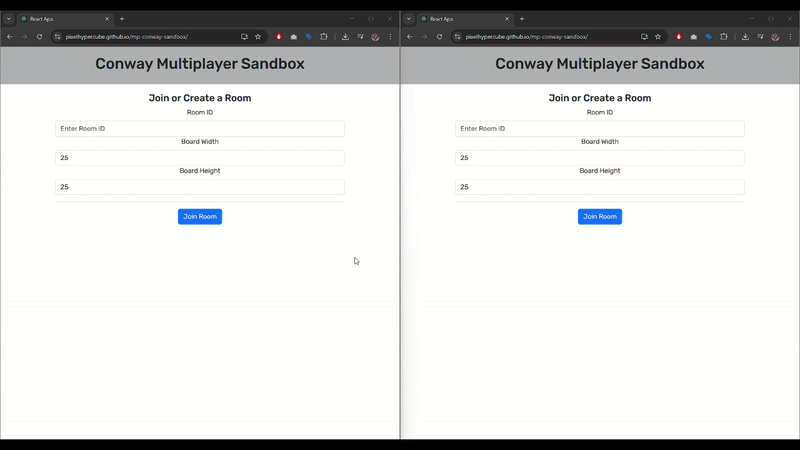

# 🧬 CellCollab



**CellCollab** is a multiplayer sandbox implementation of **Conway's Game of Life** with real-time interaction and **custom brushes**! This project is built with **React.js** and **Socket.IO**, allowing users to collaborate and simulate cellular automata together in real-time.

🔗 **Live demo**: [https://pixelhypercube.github.io/CellCollab/](https://pixelhypercube.github.io/CellCollab/)

---

## 🧠 What is Conway's Game of Life?

Conway's Game of Life is a zero-player game where a grid of cells evolves over time based on a simple set of rules. It's a classic example of **cellular automata**.

> 📖 Learn more: [Wikipedia - Conway's Game of Life](https://en.wikipedia.org/wiki/Conway%27s_Game_of_Life)

---

## 🚀 Features

- 🎮 **Multiplayer Support**: Create or join a collaborative sandbox in real time.
- 🖌️ **Brush System**: Select from multiple brushes to draw complex patterns.
- ⚙️ **Custom Board Sizes**: Optional settings to configure width and height.
- ⏯️ **Control Simulation**: Start, pause, step, and reset generations.
- 📋 **Clipboard Support**: Easily copy and share your Room ID.

---

## ✨ What’s New?

### 🖌️ Brush Tool

Choose from a palette of predefined brushes (e.g. Glider, Toad, Pulsar) to stamp patterns directly onto the board:

- Real-time brush preview before stamping
- Instant updates across all players
- Toggle cells or entire patterns with a click

---

## 🧪 Beginner Tutorial: How to Use CellCollab

### ✅ Step 1: Join or Create a Room

1. Go to the [Live Demo](https://pixelhypercube.github.io/CellCollab/)
2. To **create a new room**, simply **leave the Room ID blank** and click **"Join Room"**
3. To **join an existing room**, enter the Room ID you received
4. (Optional) Customize board width and height
5. Click **Join Room**

> Everyone using the same Room ID sees and interacts with the same board!

---

### 🎮 Step 2: Interact with the Grid

Once you're in a room, you'll see a live grid of cells and control buttons:

- ▶️ **Play / Pause** the simulation
- ⏭️ **Step** through one generation at a time
- 🔄 **Reset** to clear the board

Click on any cell to toggle its state — all changes are synced across users in real time.

---

### 🖌️ Step 3: Use Brushes

1. Scroll to the **Palette** section
2. Click a **brush** to select it
3. Hover over the grid to preview the shape
4. Click to **stamp** the brush pattern

> Try combining different brushes to create chaotic or stable systems!

---

## 📐 Game of Life Rules

1. A **live cell** with 2 or 3 live neighbors survives.
2. A **dead cell** with exactly 3 live neighbors becomes alive.
3. All other live cells die. All other dead cells remain dead.

---

## 👥 Multiplayer Tips

- Share your Room ID with friends to collaborate in real time
- Any user in the same room can:
  - Add/remove cells or patterns
  - Control the simulation
  - See changes instantly

---

## 🛠️ Tech Stack

- 💻 **React.js** – UI rendering and state management
- 🌐 **Socket.IO** – Real-time WebSocket communication
- 🧠 **Custom Brush Engine** – Hover detection & pattern placement
- 🎨 **React Bootstrap** – UI components and styling
- 🧩 **Node.js + Express** – Backend server (for local dev)

---

## 📦 Getting Started (Local Setup)

#### Clone the repo and install dependencies:

```
git clone https://github.com/pixelhypercube/CellCollab.git
cd CellCollab
npm install
```

#### Start the backend server:
```
node server.js
```

#### Start the frontend:
```
npm start
```

Visit http://localhost:3000 to begin.

## 🙌 Contributions

Pull requests are welcome! Whether it's adding new brushes, optimizing performance, improving UX, or expanding multiplayer functionality — feel free to contribute. ❤️